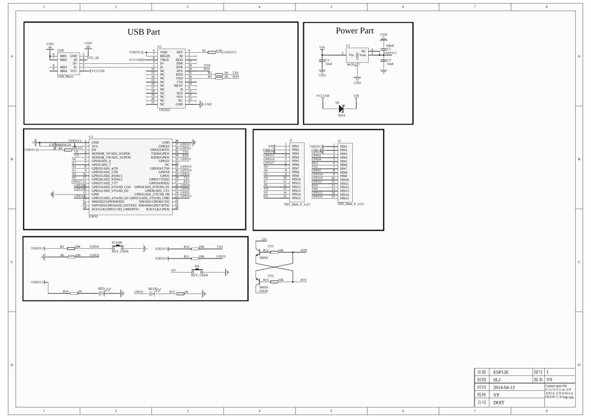

## TL/DR

RX0 / TX0 are used by the onboard silabs USB/serial chip and shouldn't be used for UART in your project

## Pinouts / Schematics

### Espressif 

* [ESP32-WROOM-32 Datasheet](https://www.espressif.com/sites/default/files/documentation/esp32-wroom-32_datasheet_en.pdf)
* [ESP32-Devkit-C Page](https://www.espressif.com/en/products/devkits/esp32-devkitc) 
* Devkit [Technical Documents](https://www.espressif.com/en/support/documents/technical-documents)

### External Pinout Resources

* <https://johnmu.com/picking-esp32-dev-board/>
* <https://www.etechnophiles.com/esp32-dev-board-pinout-specifications-datasheet-and-schematic/>
* <https://www.studiopieters.nl/esp32-pinout/>

## MicroPython

* MicroPython for ESP32 [firmware download page](https://micropython.org/download/esp32/)
* ESP32 Micropython Documentation 
    * [quickref](https://docs.micropython.org/en/latest/esp32/quickref.html)
* Asynchronous micropython-based [MQTT repository](https://github.com/tve/mqboard)

## Python IDE

1. [ESP32 Installation and Setup](/esp32-installation-and-setup/)
1. [Working With Thonny](/working-with-thonny/)

