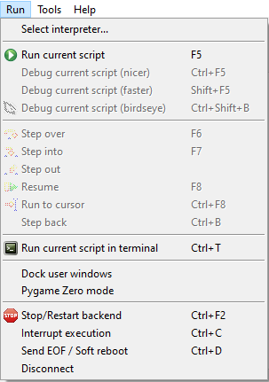

## Menu & Icons

### File


* File --> Open(ctrl+o): If the ESP32 is connected it permits you to open a file either on your computer or from the ESP32's file space.

    

* File --> Save(ctrl+s): Saves the file to the current destination
* File --> Save As(ctrl+shift+s): Permits you to save the file to a new destination, as well as to switch between saving to PC or ESP32

## Run



* Run --> Run current script(f5): This runs whatever code is in your current window.  If the file is not saved, it will ask where to save it, but the code is executed _through the shell_ rather than through the normal startup execution of the ESP32.  You can save your code to your computer and run it on the ESP32 just by hitting f5, but then this means that once restarted, the ESP32 will not be able to run the code without running it again through Thonny.
* Run --> Stop/Restart Backend: This will attempt to restart the shell, if for example you want to put the ESP32 in "interactive" mode after it was restarted and began to run its internal boot.py --> main.py sequence.


## Shell / Python Interpreter


The shell is at the bottom, and permits you to interact directly with the ESP32.  Type in a python command and it will run it and (usually) return a value.

For example:

```python
MicroPython v1.18 on 2022-01-17; ESP32 module with ESP32
Type "help()" for more information.
>>> a=1
>>> a
1
>>> 
```

### Shortcuts


* Ctrl+C: This stops (interrupts) execution of your code, wherever it is.  Python throws an exception and indicates where it was stopped.

## Files

Files in python are called "modules".  To load a module you should use the ```import``` statement.  The ESP32, however, also handles specific files as special cases:

* boot.py: If this file is present on the ESP32, it will be the first code to run after a hard reset
* main.py: If this file is present, it will be the second script that gets run automatically after a hard reset.  It only runs once, so you have to implement a ``while``` loop if you want code to continue running.
* any other file: You must ```import``` that file in either boot.py or main.py if you want it to be loaded and run.  For example, if you have a file called "my_program.py", and want it to be run from "main.py", open up "main.py" and add


```python
import my_program
```

This will load and run the my_program.py module at that specific point in the code.

### ```upip```

Micropython has the capability to download and use packages from the internet.  the ```upip``` module is responsible for this, and you can use it to download and install a number of useful external libraries.  For example, assuming you have a working wifi connection established, you can type in the following to the shell

```python
>>> import upip
>>> upip.install('micropython-logging')
```

This has the effect of downloading the "micropython-logging" package from the pypi python repository to the "/lib/" folder.

<div class="alert alert-warning">
Not all pypi packages are compatible with micropython, and will throw an error if you attempt to install them.
</div>

## ESP32

* Reset Button (EN): Use this button to restart the ESP32
* Bootloader Button (Boot): This doesn't seem to be necessary to program or work with micropython.  It is most likely used for programming with other tools/languages/IDE's to initiate "bootloader mode".
