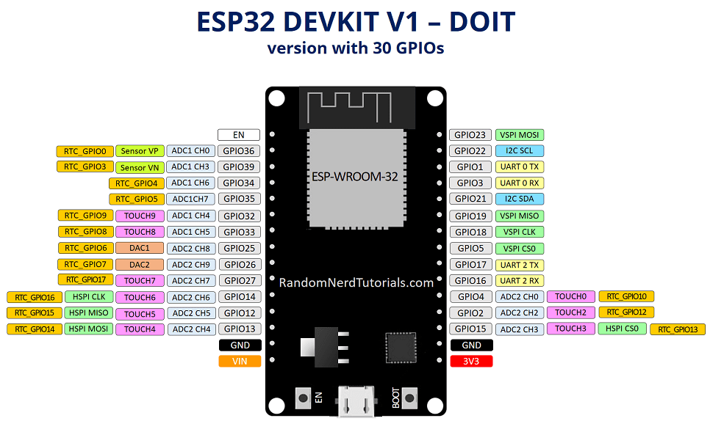

---
title: ESP32 and MicroPython
---

## Welcome


* Group Padlet Link HERE
* Presentation Folder

## Vocab Review from Yesterday!


* Go to our Kahoot Game!
* https://play.kahoot.it/v2/?quizId=b9e3cfc4-d2fe-4c3f-adad-e9f343f837cd

## Overview of the ESP32 DevKit DOIT V1


<!-- 

## TL/DR


* RX0 / TX0 are used by the onboard silabs USB/serial chip and shouldn’t be used for UART in your project

-->

## Pinouts / Schematics




* from https://randomnerdtutorials.com/getting-started-with-esp32/

## Board Layout


## Mount your ESP32 on your Breadboard


## ESP32 Links

* Espressif
  * ESP32-WROOM-32 Datasheet
  * ESP32-Devkit-C Page
  * Devkit Technical Documents
* External Pinout Resources
  * https://johnmu.com/picking-esp32-dev-board/
  * https://www.etechnophiles.com/esp32-dev-board-pinout-specifications-datasheet-and-schematic/
  * https://www.studiopieters.nl/esp32-pinout/

# MicroPython Intro


## What is Python?


* Easy to learn programming language
* Interpreted Language - write code and have it execute without compiling!
* Simple formatting: mostly spaces, few extraneous characters, similar basic keywords as other languages, easy access to complex data types
* An extensible system of software “packages”
  * use pip/pypi to install
  * install straight from github!

* * as of March 2022, tiobe.com

## Is there anything else?


* “Dynamically Typed”
  * Variables don’t need to be declared as one type or another. You simply set them equal to something and they become that data type.
* Object-oriented
  * concept of classes and inheritance
* “Public” by definition
  * data is not easily hidden.
  * data is accessible by anything

## So then, why other languages?


* Lower level languages can be easier to connect to hardware’s functionality
* Compilation makes running code faster and more memory efficient

## What is Anaconda/Miniconda?


* A “distribution” of Python for your PC
  * A way to manage all the “packages” you can install on your PC
  * A solution for dealing with conflicting installation requirements.
  * A way to share packages that contained OS-specific, compiled libraries.

## What is MicroPython?


* A slimmed down, limited version of Python that fits within the program space of a little microcontroller
* The system of software packages written for it
* The same idea of an interpreter… you just access it over USB.

## What is Thonny?


  * a Graphical User Interface (GUI) written in Python
  * A text editor
  * The interface to your device and its interpreter
  * A nice way to re-flash your device

## Python Interpreter


* Simple program that runs scripts or typed commands.
* A lot like bash, powershell, or cmd, only cross-platform and independent of the operating system.

<!-- 

## Why do I need to use Anaconda?


* Many packages include libraries that are compiled specific to one operating system
* this requires a compiler, and understanding the compilation process in case it doesn’t work
* or, requires access to compiled packages
* * https://www.lfd.uci.edu/~gohlke/pythonlibs/

-->

## Ok, so how do I get started?


  * Install Miniconda
  * Get ESP32 Working
    * Install Thonny Packages
    * Install USB Device Drivers
    * Flash the ESP32 with MicroPython over USB
  * Start writing code…

## Working With Thonny


* See this Tutorial

## Python Tutorials


* Basic Data Types
* Advanced Data Types
* Operators and Operations
* Conditional Statements (If-then)
* Loops (For/While)
* Functions
* Classes

## First ESP32 Program

```python
from machine import Pin
from time import sleep

led = Pin(2, Pin.OUT)

while True:
    led.value(1)
    sleep(1)
    led.value(0)
    sleep(1)
```

## ESP32 Wifi Access Point and Web Server


* find it on our Padlet!

## MicroPython / ESP32 Resources


* MicroPython for ESP32 firmware download page
* ESP32 Micropython Documentation
  * quickref
* Asynchronous micropython-based MQTT repository

