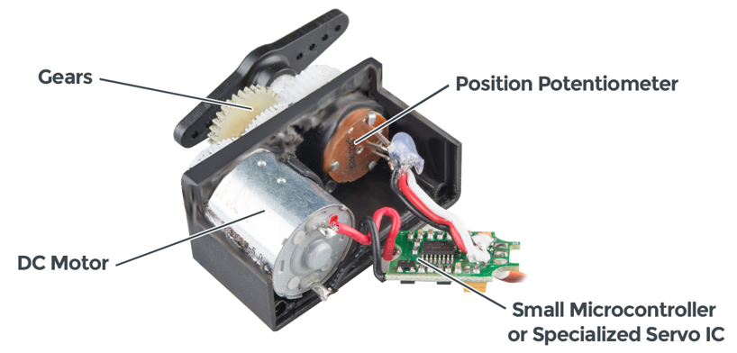
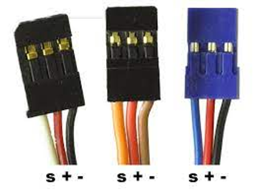
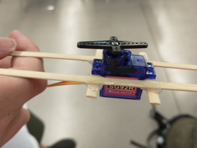
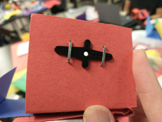

## What is an RC Servo

* Not just a motor, an “Electromechanical System”

## What’s inside

* https://www.sparkfun.com/servos

## Common Servo Sizes

## How do you plug in a Servo?

* Three wires:
* Ground - usually black
* Power - usually red
* Signal - neither red nor black

## Other Kinds of Servos

* Linear Servos: Same idea, only you use a lead screw to translate the output rather than rotate
* Continuous Rotation Servos: The potentiometer is removed, so the control signal just relates to speed
* Servos with Feedback: Extra wire for position value

## Servo Mounting Ideas

## Controlling a Servo

* PWM: Pulse Width Modulation
* The “value” sent by a PWM signal is the proportion of the time on vs the “period”, or time between signals
* frequency = 1/period
* period = 200ms
* frequency = ?

## Python Code for Controlling a Servo

* from machine import Pin, PWM
* from time import sleep
* frequency = 50
* range_low = 28
* range_high = 122
* servo1 = PWM(Pin(13), frequency)
* 
* while True:
*     servo1.duty(range_low)
*     sleep(1)
*     servo1.duty(range_high)
*     sleep(1)

## More Advanced

* from machine import Pin, PWM
* from time import sleep
* frequency = 50
* range_low = 28
* range_high = 122
* servo1 = PWM(Pin(13), frequency)
* servo2 = PWM(Pin(12), frequency)
* 
* def angle_to_pwm(degrees):
* 	output_range = 122-28
* 	input_range = 180-0
* 	output_pwm = ((degrees/input_range)*output_range)+range_low
* 	return int(output_pwm)
* 
* 
* servo1.duty(angle_to_pwm(90))
* 
* while True:
* 	for angle in range(0,1800,1):
*     	print(angle/10)
*     	servo1.duty(angle_to_pwm(angle/10))
*     	sleep(.01)
* 	for angle in range(1800,0,-1):
*     	print(angle/10)
*     	servo1.duty(angle_to_pwm(angle/10))
*     	sleep(.01)

## Controlling a Sevo with respect to time

* See this padlet post…

## More Information

* https://www.sparkfun.com/servos
* 
* Day 2 Kahoot Vocab Practice

