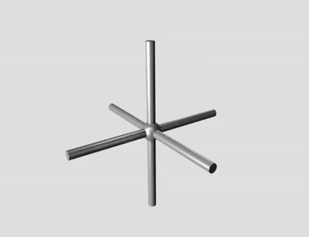
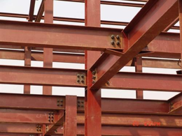

---
---

# 02-foldable-mechanisms.md

## Foldable Mechanisms

* 

## Group Roles

  * Leader - Responsible for organizing resources, helping design the robot, maintaining a positive group dynamic by making sure everyone is heard and respected, enforcing rules (be respect yourself, each other, and this place), create presentation for the final project using all group members work.
  * Coder - Responsible for coding the microcontrollers, servos, and sensors. Responding to group feedback and input. Requires a laptop.
* 
  * Builder - Responsible for assembling the robot using the mechanisms, linkages, and joints demonstrated in class. Responding to group feedback and input.
* 
* NOTE: throughout the camp, each person may function as multiple roles, so the challenge will be doing what needs to be done without getting in each other's way by COMMUNICATING EFFECTIVELY (use I statements - I think, I feel, I wonder) :-)

## Keywords

* Mechanism
* Link
* Linkage
* Joint
* Degrees of Freedom

* NOTE: As we move through the slides, consider everyday applications.
* We will use the following concepts to make a pop up book that demonstrates the functionality of each mechanism and linkage.

## Activity

* Find an example of a simple, or complicated pop up book.
* Once you have found one, provide the link in the text box on your screen and be prepared to discuss the types of linkages, mechanisms, and joints demonstrated by your example.

* Step 1

## Activity

* Get out construction paper, scissors, staplers, etc
* Create at least one flip book page using any combination of mechanisms.
* As a team combine your pages into one book.

* Step 2

## Why are we talking about foldable mechanisms?

* Robots are mechanisms, or machines.
* Serial vs. Parallel
* Composed of links and joints

## Mechanisms

* A system of parts working together in a machine; a piece of machinery.

* https://en.wikipedia.org/wiki/Mechanism_(engineering)

* https://languages.oup.com/google-dictionary-en/

## Serial Mechanisms

* CNX OpenStax, CC BY 4.0, via Wikimedia Commons

* A serial mechanism, also known as a serial chain or serial linkage, refers to a mechanical system in which components or links are arranged in a linear sequence, with each component connected to the one before and after it. The output motion or force is transmitted through each link in a sequential manner from the input to the final output.
* 
* In a serial mechanism, the motion or force is transmitted through a series of interconnected links or elements, typically connected by joints or hinges. Each link is responsible for transmitting or transforming the input motion or force to the next link in the chain, until it reaches the final output.

## Parallel Mechanism

* In kinematics, a parallel mechanism refers to a mechanical system consisting of multiple interconnected links that are connected in a way that allows them to move simultaneously and independently of each other. These links are arranged in a parallel configuration, meaning they share a common base and have multiple end-effectors.
* 
* To understand this concept, let's use an example of a parallel robot called a Delta robot. A Delta robot consists of three parallel arms connected to a base and a common platform, which acts as the end-effector. Each arm has multiple joints that allow it to move in various directions.

## Degrees of Freedom

* In the context of motion and mechanics, degrees of freedom refer to the number of independent ways an object or system can move. It represents the different directions or types of motion that an object is capable of.
* 
* To understand degrees of freedom, let's consider a simple example: a point particle in space. A point particle can move freely in three dimensions: forward and backward (along the x-axis), left and right (along the y-axis), and up and down (along the z-axis). In this case, the point particle has three degrees of freedom.

* How many degrees of freedom are represented in this gif?

## Degrees of Freedom Continued

* “The number of independent parameters that define its configuration or state”
* The position of a single railcar (engine) moving along a track has one degree of freedom
* Position and orientation of a rigid body in space is defined by three components of translation and three components of rotation, which means that it has six degrees of freedom.

* https://en.wikipedia.org/wiki/Degrees_of_freedom_(mechanics)

## Kinematic Structures

* Kinematic structure refers to the arrangement and configuration of links, joints, and degrees of freedom in a mechanical system or mechanism. It provides a description of how the components are connected and how they allow or restrict motion.
* 
* In a mechanical system, the kinematic structure defines the overall shape, connectivity, and relative motion of the components. It specifies the arrangement of links (rigid bodies) and the types of joints (points of connection) between them.

## Link

* An intermediate rod or piece for transmitting force or motion; especially, a short connecting rod with a hole or pin at each end.

## Joints

* In robotics, joints are the connections between rigid bodies which facilitate motion
* Many different kinds of joints with different degrees of freedom
* Folded devices use systems of joints

* Flores, Paulo & Lankarani, Hamid. (2016). Contact Force Models for Multibody Dynamics.

## Linkage

* In kinematics, a linkage refers to a system of rigid bodies connected by joints or links that allow relative motion between them. Linkages are used to transmit and control motion or force in mechanical systems.

* https://en.wikipedia.org/wiki/Linkage_(mechanical)\

## More Complex Joints

* Chase, Kenneth & Magleby, Spencer & Glancy, Charles. (2000). A Comprehensive System for Computer-Aided Tolerance Analysis of 2-D and 3-D Mechanical Assemblies. 10.1007/978-1-4615-5797-5_23.

## Joints

* https://24.media.tumblr.com/tumblr_mck6ejg15N1r0v3zro3_1280.jpg

## Origami vs. Kirigami

* https://www.youtube.com/watch?v=kUsxMXwCW8A

* Origami: Less about mechanisms and more about “structures” or “form”

## “Foldable” Links

* How can you stiffen material to create a better link?
  * …
  * …
  * …

## “Foldable” Links

* How can you stiffen material to create a better link?
  * …
  * …
  * …
* Engineering Context: I-beams

## “Foldable” Joints

* What joints can you make with origami/kirigami techniques?
* How can you weaken material to create a better joint?
  * …
  * …
  * …

## Identical mechanisms, many ways to get there

* Four-Bar Linkage Example
* Sarrus Example

## Types of Linkages

* Planar
* four-bar
* five-bar
* six-bar
* …
* Spherical
* four-bar
* five-bar
* six-bar
* …

* Other:
* Sarrus
* Straight-line
* Slider-Crank
* More Info
* https://en.wikipedia.org/wiki/Linkage_(mechanical)#Image_gallery
* https://engineering.library.cornell.edu/kmoddl/

