* Taking a page from nature’s book

<!-- ## After Lunch Plan

* Origami Wrap-up - More Mechanisms
* Biomechanics & Bioinspiration
* continue identifying important keywords and putting them in padlet
* Look up an animal
* look up keywords in google scholar
* Make a 1-slide presentation / proposal
  * what motion do you want to
  * find a video of it moving
  * what information did you find on it?
  * What’s your idea for how to make it “foldable”?
* Form Teams
* Make a body module. -->

## Key Terms

* Biomechanics
* Bio-inspiration
* Serial Mechanism
* Parallel Mechanism
* Servo
* Work Loop
* Inverted Pendulum
* Spring Loaded Pendulum

## Biomechanics Vs. Bio-Inspiration

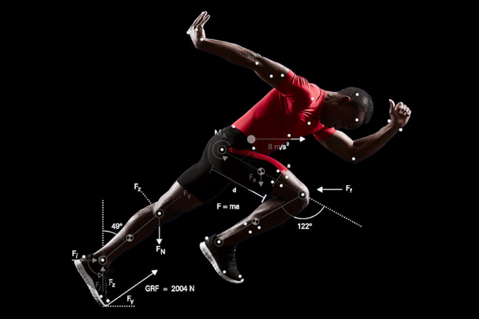

* Biomechanics
* 
  * Biomechanics is a field of study that combines biology and physics to understand how living organisms, including humans and animals, move and interact with their environment.
* 
  * To put it simply, biomechanics helps us understand how our bodies work when we perform activities like walking, running, jumping, or throwing. It explores the forces, motions, and structures involved in these movements.

* Bio-inspiration
  * Bio-inspiration, also known as biomimicry or biomimetics, is a concept that involves taking inspiration from nature and using it to solve human problems or create innovative designs and technologies.
* 
  * When we look at nature, we can find a wide variety of plants, animals, and organisms that have evolved over millions of years. They have developed unique adaptations, structures, and processes that allow them to survive and thrive in their environments.

## Complete the sentence below in your text box

  * Robotic Systems help us understand the biological world by…
  * Mimicking biological structures can…
  * One benefit of Bio-inspiration is that experiments can be designed and repeated vs. observed. An example of this is…
  * In bioinspiration, variation in form and function can be introduced because…
* 

## The Human Skeleton - A (Branching) Serial Mechanism

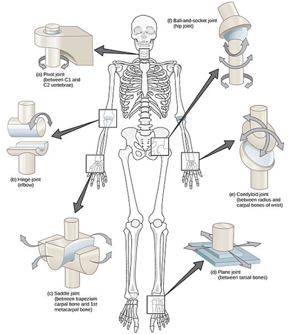

* CNX OpenStax, CC BY 4.0, via Wikimedia Commons

* Serial Mechanism: Systems of consecutive movement - Joint A moves, then Joint B, then Joint C, and so on.
* Many human joints can be described by “basic” joint types (e.g. ball and socket, hinge, saddle, pivot, and plane joints)

## Serial Mechanism Examples

* Consider the motion below - if you had one motor, where would you place that motor to drive the motion in either of these Serial mechanisms? Drag the star below to that point.

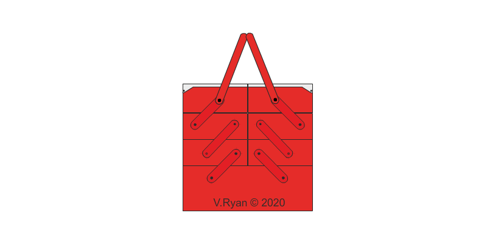

## Skeletons Can be Parallel Mechanisms

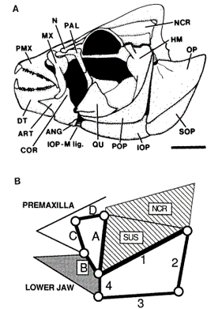
[Video](https://www.youtube.com/watch?v=pDU4CQWXaNY)
* https://www.youtube.com/watch?v=pDU4CQWXaNY

* Westneat, M.W. (1990), Feeding mechanics of teleost fishes (Labridae; Perciformes): A test of four-bar linkage models. J. Morphol., 205: 269-295. https://doi.org/10.1002/jmor.1052050304

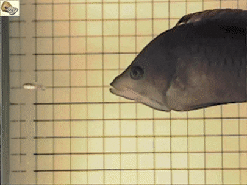

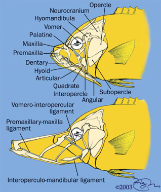

## Parallel Mechanism

* In kinematics, a parallel mechanism refers to a mechanical system consisting of multiple interconnected links that are connected in a way that allows them to move simultaneously and independently of each other. These links are arranged in a parallel configuration, meaning they share a common base and have multiple end-effectors.
* 
* To understand this concept, let's use an example of a parallel robot called a Delta robot. A Delta robot consists of three parallel arms connected to a base and a common platform, which acts as the end-effector. Each arm has multiple joints that allow it to move in various directions.

## Parallel Mechanism Examples

* Consider the motion below - if you had one motor, where would you place that motor to drive the entire parallel mechanism? Drag the star below to that point.

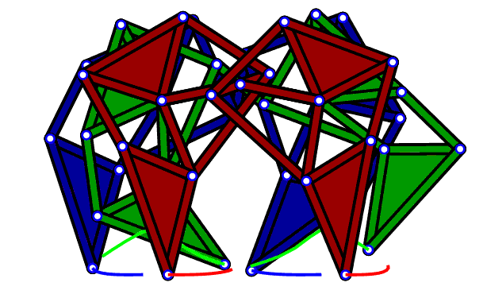

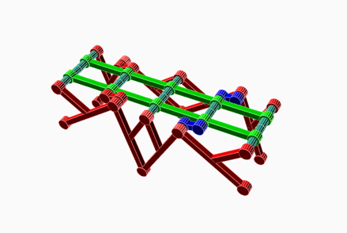

## Arthropod Joints

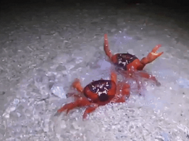

* From Barnes, R. D. 1964. Invertebrate Zoology. W. B. Saunders. Philadelphia.  Found here

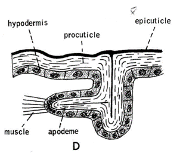

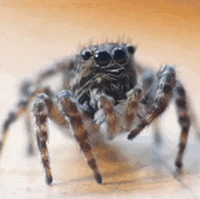

## Arthropod Joints

* Different Joint types, different degrees of freedom

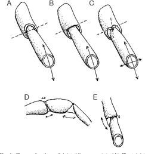

* Wootton, Robert J.. “Invertebrate paraxial locomotory appendages: design, deformation and control.” The Journal of experimental biology 202 Pt 23 (1999): 3333-45 .

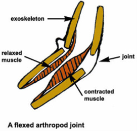

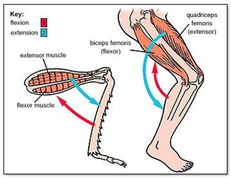

## Skeletal Muscle

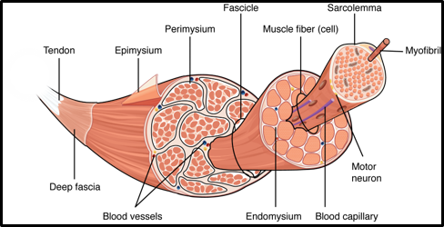

* https://open.oregonstate.education/aandp/chapter/10-2-skeletal-muscle/
* Anatomy & Physiology by Lindsay M. Biga, Sierra Dawson, Amy Harwell, Robin Hopkins, Joel Kaufmann, Mike LeMaster, Philip Matern, Katie Morrison-Graham, Devon Quick & Jon Runyeon is licensed under a Creative Commons Attribution-ShareAlike 4.0 International License, except where otherwise noted.

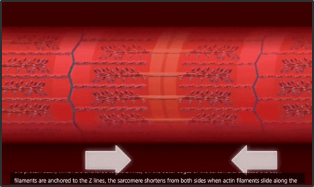

## How can a servo stimulate muscle contraction?

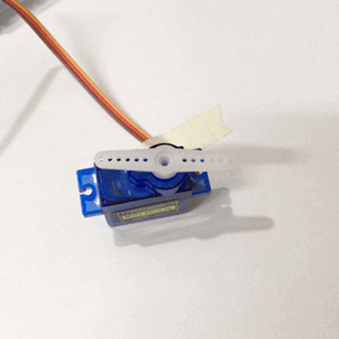

## Skeletal Muscle Examples

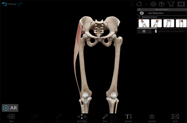

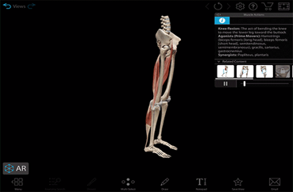

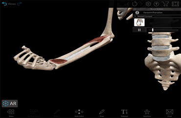

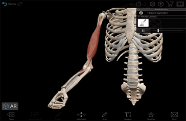

* Supination - When your palm or forearm faces up

* Pronation -When your palm or forearm faces down

## Muscles can do Different things

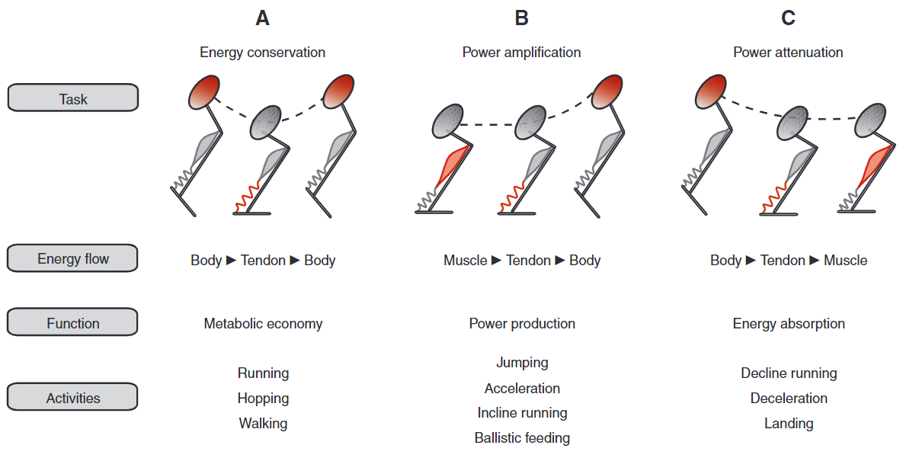

* Roberts, T. J., & Azizi, E. (2011). Flexible mechanisms: the diverse roles of biological springs in vertebrate movement. Journal of Experimental Biology, 214(3), 353–361. https://doi.org/10.1242/jeb.038588

## Work Loop

* In kinematics, we study the motion of objects and how they change their position over time. When we talk about work, we are referring to the effort or energy required to move an object.
* Now, imagine you have a ball and you want to move it from one point to another. In order to do that, you have to apply a force to the ball. The force you apply to the ball makes it move. The work you do on the ball is the energy you spend to make it move.
* A work loop is a way to visualize and understand the work done on an object as it moves through a closed path or loop. It helps us understand how energy is transferred to the object and how it changes its position.
* https://en.wikipedia.org/wiki/Work_loop

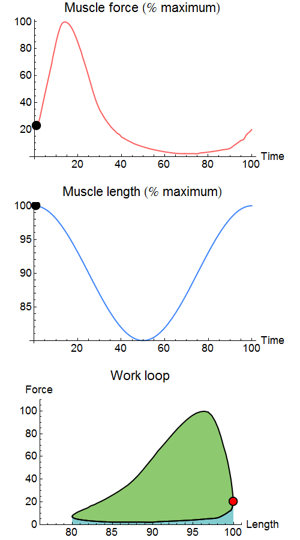

## Force relationship to the work loop of Skeletal Muscle

* Isometric force occurs when you exert force against an object that doesn't move, or when you resist a force without changing the length of your muscles. For example, pushing against a wall with all your strength or holding a weight in a fixed position without moving it are both examples of generating isometric force. 
* 
* Biewener, Andrew & Gillis, Gary. (2000). Dynamics of muscle function during locomotion: Accommodating variable conditions. The Journal of experimental biology. 202. 3387-96. 10.1242/jeb.202.23.3387.

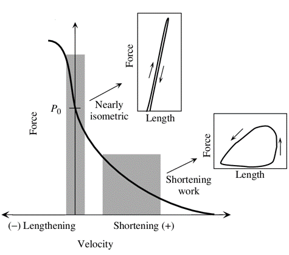

## Inverted Pendulum vs Spring-Loaded Inverted Pendulum

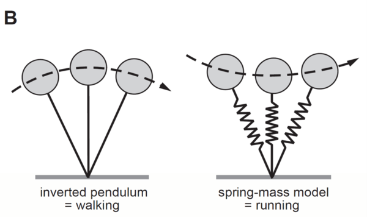

## The Inverted Pendulum

* An inverted pendulum refers to a system where a rigid rod or pole is balanced in an inverted, or upside-down, position. Unlike a regular pendulum that hangs downward, an inverted pendulum is positioned with its base or pivot point above its center of mass.
* The inverted pendulum is an interesting and challenging system to study in kinematics and control theory because it requires active control to maintain its balance. Without any control, the inverted pendulum would fall due to the unstable nature of its equilibrium position.

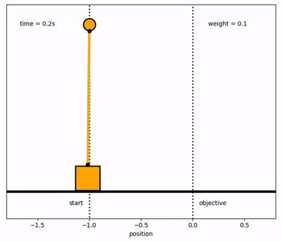

## The Spring-Loaded Pendulum

* The Spring-Loaded Pendulum consists of a mass (often represented by a bob or weight) attached to a rigid rod or string, forming a pendulum. In addition to the gravitational force acting on the mass, there is a spring attached to the pendulum that exerts a force proportional to the displacement of the mass from its equilibrium position.
* When the Spring-Loaded Pendulum is displaced from its equilibrium position, the spring exerts a restoring force that brings the pendulum back towards its equilibrium. As the pendulum moves towards the equilibrium, the spring compresses or stretches, storing potential energy.

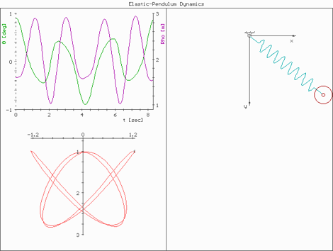

## Real World Examples

* Reference Robots

* Refer to the following slides for inspiration. Pay attention to the motion over time, and imagine the energy and forces within the work loop. Things to consider:
* Range of Motion
* Weight/ Distribution of Weight
* Attachment/ anchor points
* Serial vs. Parallel Mechanisms
* Types of Joints

## Passive Dynamic Walker

[Video](https://www.youtube.com/watch?v=FfKQSUhYjlY)

## SLIP Legs

[Video](https://www.youtube.com/watch?v=XFXj81mvInc&feature=emb_logo)
## Implementations of SLIP

* A. Sprowitz, A. Tuleu, M. Vespignani, M. Ajallooeian, E. Badri, and A. J. Ijspeert, “Towards dynamic trot gait locomotion: Design, control, and experiments with Cheetah-cub, a compliant quadruped robot,” Int. J. Rob. Res., vol. 32, no. 8, pp. 932–950, Jul. 2013.

## 

[Video](https://www.youtube.com/watch?time_continue=224&v=BUmOKfllAEo&feature=emb_logo)

## 

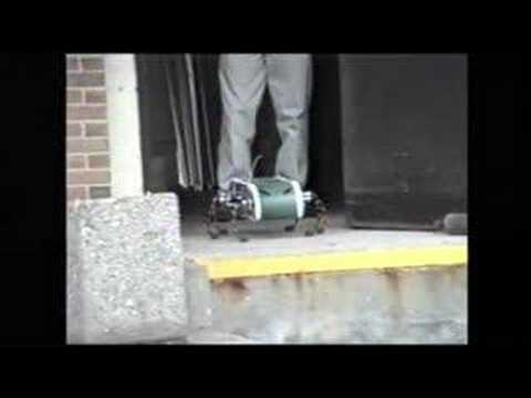
[Video](https://www.youtube.com/watch?time_continue=485&v=BUmOKfllAEo&feature=emb_logo)

## Cheetah Cub

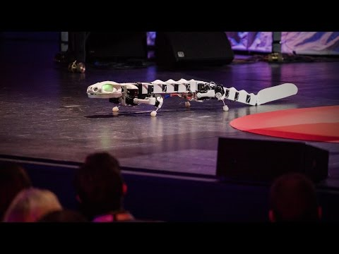
[Video](https://www.youtube.com/watch?time_continue=554&v=K926HAKRFvw&feature=emb_logo)

## MIT Cheetah

[Video](https://www.youtube.com/watch?time_continue=73&v=_luhn7TLfWU&feature=emb_logo)

## Different Animals

* M. H. Dickinson, “How Animals Move: An Integrative View,” Science (80-. )., vol. 288, no. 5463, pp. 100–106, Apr. 2000.

## Peristaltic Locomotion

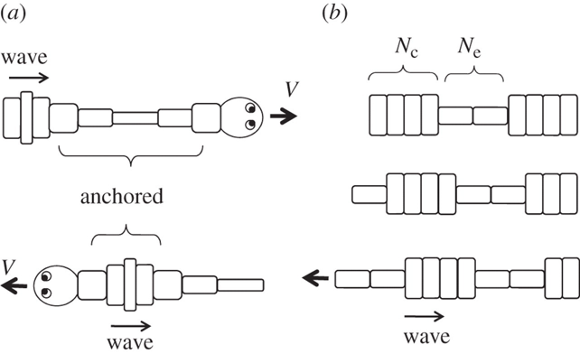

* Mechanics of peristaltic locomotion and role of anchoringJ. R. Soc. Interface.9222–233http://doi.org/10.1098/rsif.2011.0339

## Peristaltic

[Video](https://www.youtube.com/watch?time_continue=16&v=f6mA8walaSk&feature=emb_logo)

## Undulatory

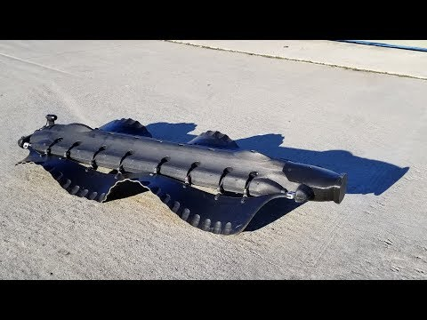
[Video](https://www.youtube.com/watch?v=CkZszsl2aIU&feature=emb_logo)

## Swimming In Sand

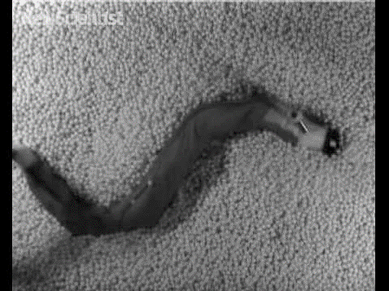
[Video](https://www.youtube.com/watch?time_continue=2&v=9mwJsGbTkOk&feature=emb_logo)

## Climbing with Stickybot

[Video](https://www.youtube.com/watch?v=e4ntbQ6isIk&feature=emb_logo)

## Foldable-Compatible Legged

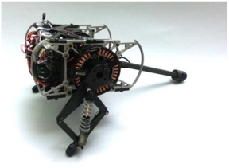

* Already Foldable
* Dash
* HAMR
* DynaROACH
* Non-Foldable
* ATRIAS/Cassie
* Penn Jerboa
* Stanford Doggo

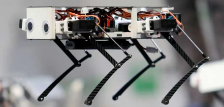

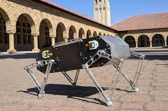

## HAMR

[Video]()

## DASH

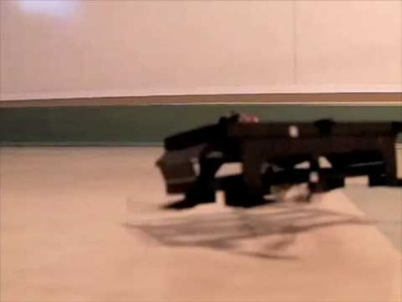
[Video](https://www.youtube.com/watch?time_continue=1&v=UjGIJR5Mxjo&feature=emb_logo)

## ATRIAS Family

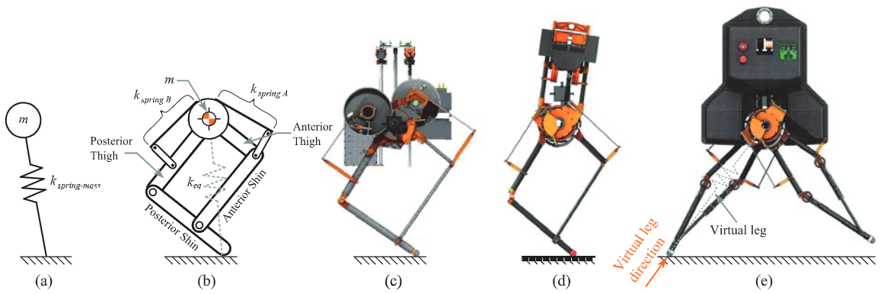

## ATRIAS / CASSIE

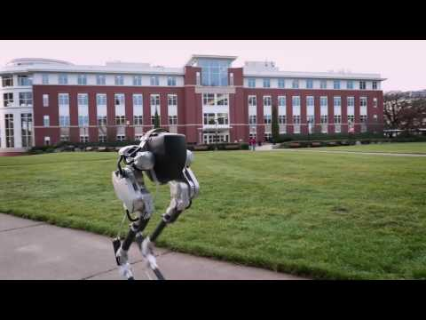
[Video](https://www.youtube.com/watch?time_continue=43&v=Is4JZqhAy-M&feature=emb_logo)

