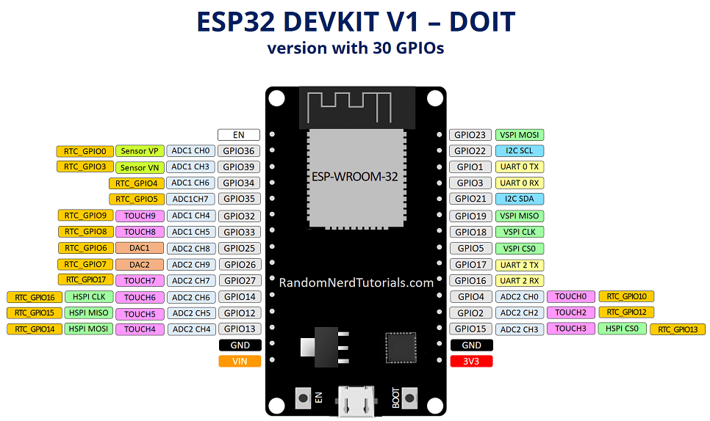

## Welcome


* Group Padlet Link HERE
* Presentation Folder

## Vocab Review from Yesterday!


* Go to our Kahoot Game!
* https://play.kahoot.it/v2/?quizId=b9e3cfc4-d2fe-4c3f-adad-e9f343f837cd

## Overview of the ESP32 DevKit DOIT V1


<!-- 

## TL/DR


* RX0 / TX0 are used by the onboard silabs USB/serial chip and shouldn’t be used for UART in your project

-->

## Pinouts / Schematics




* from https://randomnerdtutorials.com/getting-started-with-esp32/

## Board Layout


## Mount your ESP32 on your Breadboard


## ESP32 Links

* Espressif
  * ESP32-WROOM-32 Datasheet
  * ESP32-Devkit-C Page
  * Devkit Technical Documents
* External Pinout Resources
  * https://johnmu.com/picking-esp32-dev-board/
  * https://www.etechnophiles.com/esp32-dev-board-pinout-specifications-datasheet-and-schematic/
  * https://www.studiopieters.nl/esp32-pinout/

# MicroPython Intro


## What is Python?


* Easy to learn programming language
* Interpreted Language - write code and have it execute without compiling!
* Simple formatting: mostly spaces, few extraneous characters, similar basic keywords as other languages, easy access to complex data types
* An extensible system of software “packages”
  * use pip/pypi to install
  * install straight from github!

* * as of March 2022, tiobe.com

## Is there anything else?


* “Dynamically Typed”
  * Variables don’t need to be declared as one type or another. You simply set them equal to something and they become that data type.
* Object-oriented
  * concept of classes and inheritance
* “Public” by definition
  * data is not easily hidden.
  * data is accessible by anything

<!-- ## So then, why other languages?


* Lower level languages can be easier to connect to hardware’s functionality
* Compilation makes running code faster and more memory efficient

## What is Anaconda/Miniconda?


* A “distribution” of Python for your PC
  * A way to manage all the “packages” you can install on your PC
  * A solution for dealing with conflicting installation requirements.
  * A way to share packages that contained OS-specific, compiled libraries. -->

## What is MicroPython?


* A slimmed down, limited version of Python that fits within the program space of a little microcontroller
* The system of software packages written for it
* The same idea of an interpreter… you just access it over USB.

## What is VSCode?

  * A powerful code editor
  * Plugins for communicating to your device

## Python Interpreter


* Simple program that runs scripts or typed commands.
* A lot like bash, powershell, or cmd, only cross-platform and independent of the operating system.

<!-- 

## Why do I need to use Anaconda?


* Many packages include libraries that are compiled specific to one operating system
* this requires a compiler, and understanding the compilation process in case it doesn’t work
* or, requires access to compiled packages
* * https://www.lfd.uci.edu/~gohlke/pythonlibs/

-->

## Ok, so how do I get started?


  * Install Miniconda
  * Get ESP32 Working
    * Install Thonny Packages
    * Install USB Device Drivers
    * Flash the ESP32 with MicroPython over USB
  * Start writing code…

## Working With Thonny


* See this Tutorial

## Python Tutorials


* Basic Data Types
* Advanced Data Types
* Operators and Operations
* Conditional Statements (If-then)
* Loops (For/While)
* Functions
* Classes

## First ESP32 Program

```python
from machine import Pin
from time import sleep

led = Pin(2, Pin.OUT)

while True:
    led.value(1)
    sleep(1)
    led.value(0)
    sleep(1)
```


## Read ADC

```python
from machine import Pin, ADC
from time import sleep

pot = ADC(Pin(34))
pot.atten(ADC.ATTN_11DB)       #Full range: 3.3v

while True:
  pot_value = pot.read()
  print(pot_value)
  sleep(0.1)
```

## ESP32 Wifi Access Point and Web Server

```python
# Combination of the following tutorials:
# https://randomnerdtutorials.com/esp32-esp8266-micropython-web-server/
# https://randomnerdtutorials.com/micropython-esp32-esp8266-access-point-ap/

try:
  import usocket as socket
except:
  import socket

import network

import esp
esp.osdebug(None)

ssid = 'MicroPython-AP-Dan'
password = '123456789'

ap = network.WLAN(network.AP_IF)
ap.active(True)
ap.config(essid=ssid, password=password)

while ap.active() == False:
  pass

print('Connection successful')
print(ap.ifconfig())


from machine import Pin
led = Pin(2, Pin.OUT)


def web_page():
  if led.value() == 1:
    gpio_state="ON"
  else:
    gpio_state="OFF"
  
  html = """<html><head> <title>ESP Web Server</title> <meta name="viewport" content="width=device-width, initial-scale=1">
  <link rel="icon" href="data:,"> <style>html{font-family: Helvetica; display:inline-block; margin: 0px auto; text-align: center;}
  h1{color: #0F3376; padding: 2vh;}p{font-size: 1.5rem;}.button{display: inline-block; background-color: #e7bd3b; border: none; 
  border-radius: 4px; color: white; padding: 16px 40px; text-decoration: none; font-size: 30px; margin: 2px; cursor: pointer;}
  .button2{background-color: #4286f4;}</style></head><body> <h1>ESP Web Server</h1> 
  <p>GPIO state: <strong>""" + gpio_state + """</strong></p><p><a href="/?led=on"><button class="button">ON</button></a></p>
  <p><a href="/?led=off"><button class="button button2">OFF</button></a></p></body></html>"""
  return html

s = socket.socket(socket.AF_INET, socket.SOCK_STREAM)
s.bind(('', 80))
s.listen(5)

while True:
  conn, addr = s.accept()
  print('Got a connection from %s' % str(addr))
  request = conn.recv(1024)
  request = str(request)
  print('Content = %s' % request)
  led_on = request.find('/?led=on')
  led_off = request.find('/?led=off')
  if led_on == 6:
    print('LED ON')
    led.value(1)
  if led_off == 6:
    print('LED OFF')
    led.value(0)
  response = web_page()
  conn.send('HTTP/1.1 200 OK\n')
  conn.send('Content-Type: text/html\n')
  conn.send('Connection: close\n\n')
  conn.sendall(response)
  conn.close()
```

## Analog Sensor Reading

```python
from machine import Pin, ADC
from time import sleep

pot = ADC(Pin(34))
pot.atten(ADC.ATTN_11DB)       #Full range: 3.3v

while True:
  pot_value = pot.read()
  print(pot_value)
  sleep(0.1)
```


## MicroPython / ESP32 Resources


* MicroPython for ESP32 firmware download page
* ESP32 Micropython Documentation
  * quickref
* Asynchronous micropython-based MQTT repository

