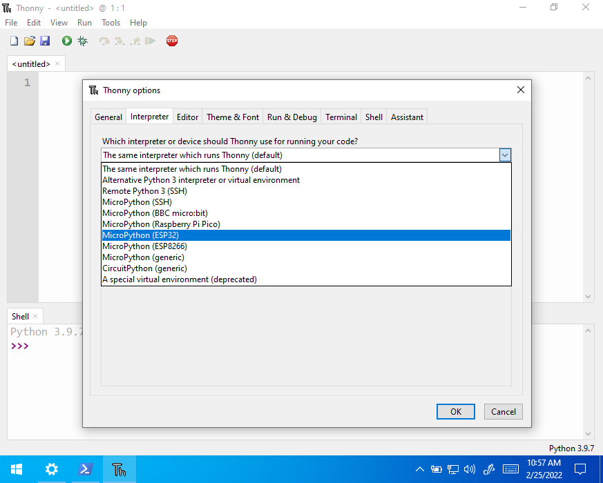
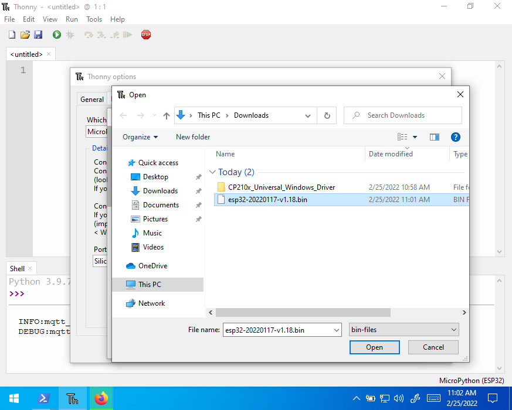
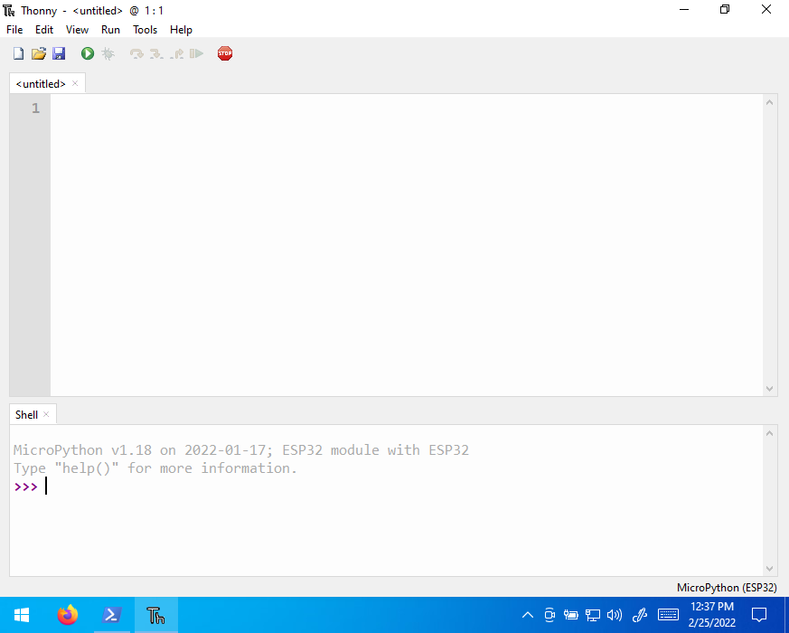
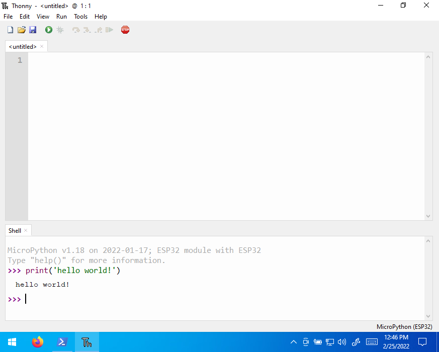

## Install Miniconda and packages

> You need to use Python on your PC to program the ESP32.  This assumes that you already have miniconda installed.  For more instructions, see [here](../installing-anaconda-python/) for detailed instructions.

1. **Installing Thonny and other Packages:** Open up your anaconda environment (start-->anaconda prompt)
    1. (optional) Activate your desired environment ```conda activate <environment_name>```.  

        > You can ignore if you want to install in the base environment

    1. type the following to install a prerequisite package

        ```bash
        conda install -y -c conda-forge wrapt
        ```

    1. Install the ESP32 commandline flashing tool

        ```bash
        pip install esptool
        ```

    1. To install Thonny type the following *(This is optional)*:

        ```bash
        pip install thonny
        ```

        **Note:** on Mac, open up terminal or xterm and type ```pip3 install esptool thonny```

## Install Device Drivers *(Required for Windows)*

The device drivers will help your computer recognize the ESP32 as a USB Device

1. Install [Silabs cp210x driver](https://www.silabs.com/developers/usb-to-uart-bridge-vcp-drivers) ([windows download](https://www.silabs.com/documents/public/software/CP210x_Universal_Windows_Driver.zip))

    _This step is required if the device is not recognized as a virtual COM port._

    

    

    

    

    

## Flashing the ESP32 Firmware for MicroPython

1. download [firmware](https://micropython.org/download/esp32/)

   > **Note:** I don't recommend v1.18 due to PWM issues.

### Option 1: Thonny approach

> Requires thonny to be installed, see [above](#install-miniconda-and-packages)

1. open cmd and type ```thonny```

    

1. open up tools-->options, select the "interpreter" tab and ensure that "Micropython (ESP32)" is selected.  Select the "Silicon Labs CP210X USB to UART Bridge Com(XY)" down below.

    

    

    

    

1. Before selecting ok, in the bottom right hand corner select "install or update firmware".  select the right port corresponding to the "Silicon Labs CP210X USB to UART Bridge Com(XY)"

    

1. select the firmware you downloaded and hit "install".

    

    

1. wait for the install to finish

    

1. Look at the interpreter window.  You should see something similar to:

    ```python
    MicroPython v1.XX on 20XX-YY-ZZ; ESP32 module with ESP32
    
    Type "help()" for more information.
    >>> 
    ```

    

1. type ```print('hello, world!')``` into the shell and that's it!  You should have a working python interpreter loaded on your ESP32!

    

### Option 2: Command-line approach with ```esptool```

windows:

```bash
esptool --chip esp32 --port COM7 erase_flash
```

linux:

```bash
esptool.py --chip esp32 --port /dev/ttyUSB0 erase_flash
```

Now flash it using the template below.  Check device manager in windows to identify the appropriate COM port

Windows:

```bash
esptool --chip esp32 --port <serial_port> write_flash -z 0x1000 <esp32-X.bin>
```

For Example:

```bash
esptool --chip esp32 --port COM7 write_flash -z 0x1000 Downloads/esp32-20220618-v1.19.1.bin
```

Linux:

```bash
esptool.py --chip esp32 --port <serial_port> write_flash -z 0x1000 <esp32-X.bin>
```

For Example:

```bash
esptool.py --chip esp32 --port /dev/ttyUSB0 write_flash -z 0x1000 esp32-20220618-v1.19.1.bin
```

## Mac Specific Suggestions

* use terminal or xterm if you have it as Macs do not have powershell
* use ```pip3 install ...``` instead of ```pip install ...``` with the most recent flavors of MacOS
* make sure ```pip``` or ```pip3```(Mac) is updated to avoid installation errors

    ```bash
    python3 -m pip install --upgrade pip
    ```

* Mac doesn't do COM, but can list USB devices.  In your terminal, type:

    ```bash
    ls -al /dev/tty.
    ```

    then unplug your ESP32 and run the previous command again to see which name for the device is the ESP32

* when selecting the port, there may be two Silicon Labs CP210X USB to UART Bridge (ESP device name here) devices.  Watch the messages in the terminal to determine the correct selection (obviously, don't use the one that says error/cannot find/etc.)
* when running the program you may need to press ctrl + c twice within thonny

## External Resources

* <https://micropython.org/download/esp32/>
* <https://randomnerdtutorials.com/flashing-micropython-firmware-esptool-py-esp32-esp8266/>

----

## Issues

If you install on a computer where you don't have administrative access, it is still possible to install  but you have to remember a couple things:

After instlling anaconda, you must add it to your path every time you want to run it.  

1. Start --> "cmd"

    ```set PATH=C:\Users\<MYUSERNAME>\Miniconda3;C:\Users\<MYUSERNAME>\Miniconda3\Library\mingw-w64\bin;C:\Users\<MYUSERNAME>\Miniconda3\Library\usr\bin;C:\Users\<MYUSERNAME>\Miniconda3\Library\bin;C:\Users\daukes\Miniconda3\Scripts;%PATH%```

    * Replace <MYUSERNAME> with your username; confirm the path exists.
    * This step is required every time you load thonny if you installed "just for me" or are on an administratively locked pc.
