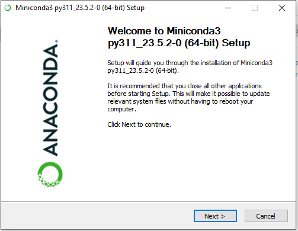
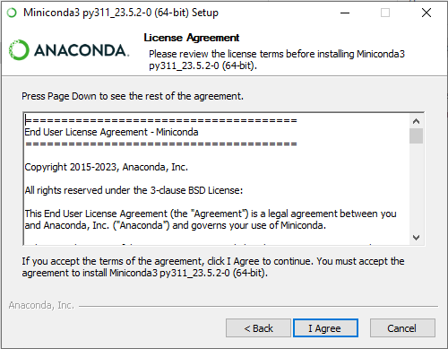
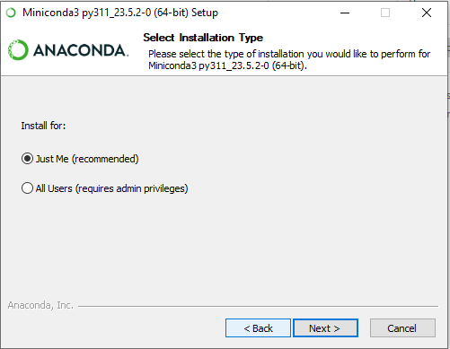
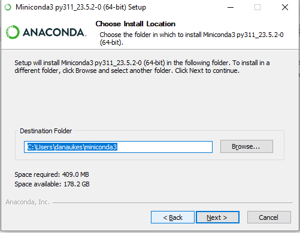
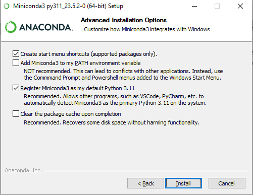
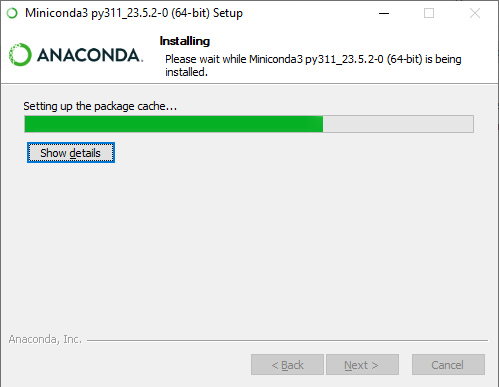
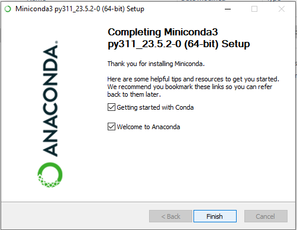
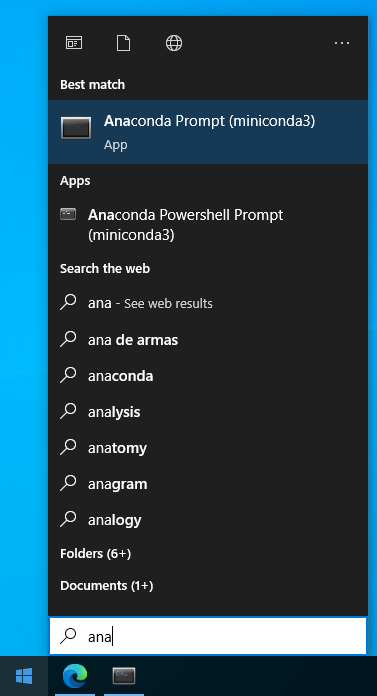

## Introduction

This tutorial is for installing the anaconda python distribution on windows.

## Windows Installation

These installation instructions are for computers that **do** **not** have Python or Anaconda installed already. Python and Anaconda do not come installed by default on most computers so if you haven't installed them intentionally, these instructions likely apply to you. If you **do** have another version of Python installed, then please ask Dr. Aukes for further details.

### Anaconda Instructions

**Note:** These instructions are for the smaller "Miniconda" distribution, that includes only the ```conda``` package manager that you can use to install only the packages that you want.  You can also install the full [Anaconda](https://www.anaconda.com/products/individual#Downloads) distribution, and follow the same basic instructions.

1. Download and install [miniconda](https://docs.conda.io/en/latest/miniconda.html) ([win64 quick link](https://repo.anaconda.com/miniconda/Miniconda3-latest-Windows-x86_64.exe)) with the following options:

    
    

    1. Install for "Just for Me" 

        

    1. Accept the the default directory (e.g., C:\\ProgramData\\Miniconda3 )

        

          <!-- > the "install for everyone" option no longer permits you to add python to the system PATH -->

          <!-- - Check the "Add Miniconda3 to the system PATH environment variable" box -->

    1. Keep the options page default, ensuring the "Register Miniconda3 as the system Python" box is checked

        
       
    1. Complete the installation

        

        

1. **Update Conda.** In Windows, go to the search bar and type "anaconda". Once you see the "Anaconda Prompt" app in the list, click on it.

    

1. When the terminal opens, paste each of the following lines (one at a time) at the command prompt and press enter:

        conda update --all
