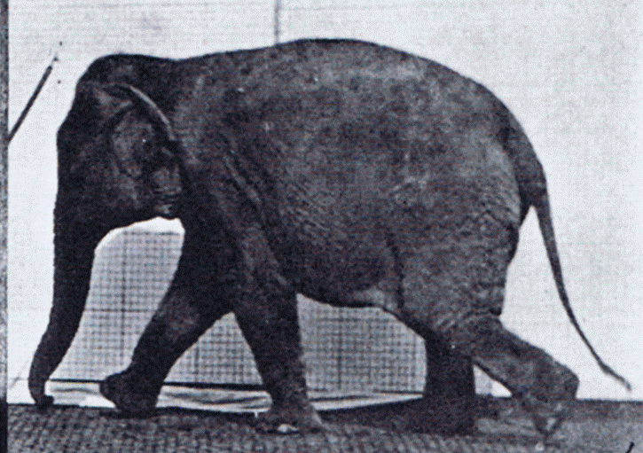
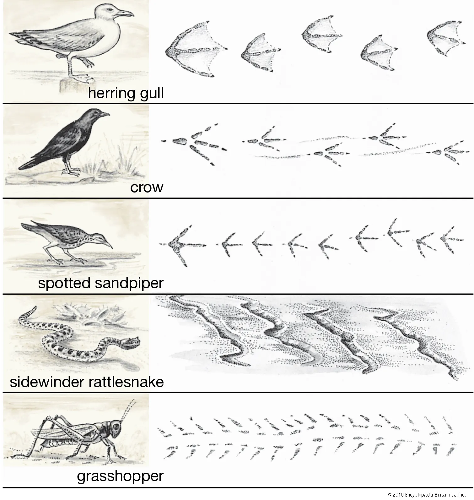
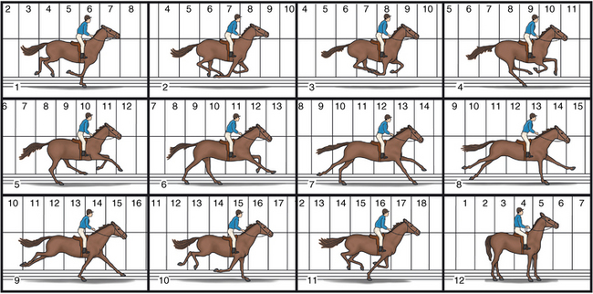
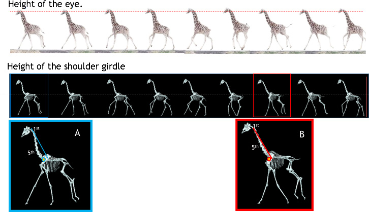
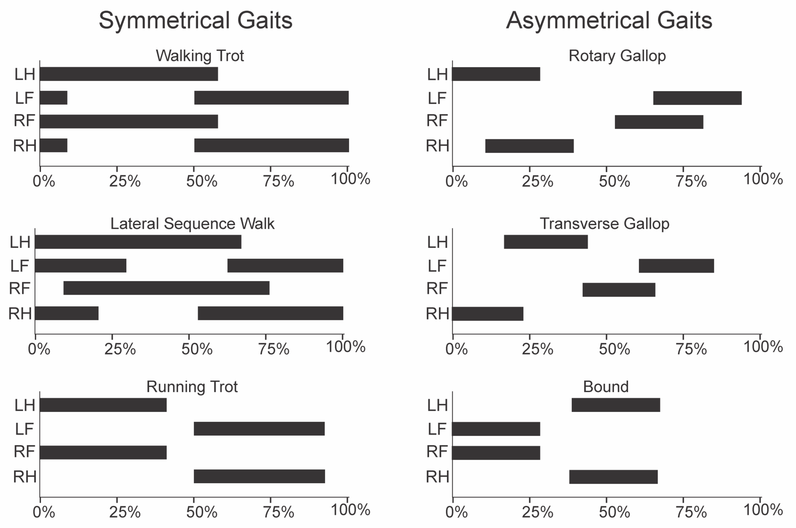
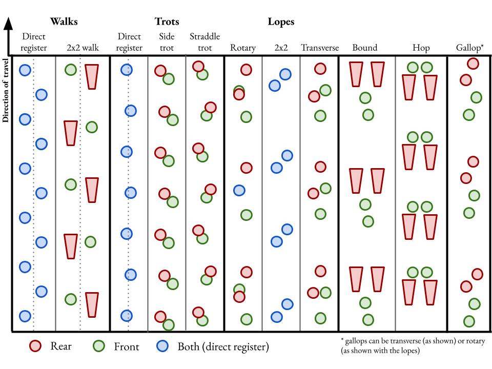
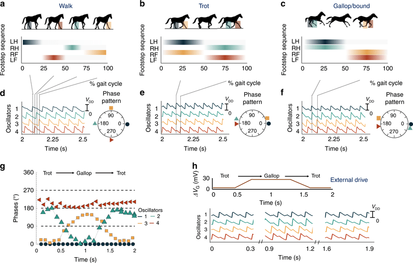
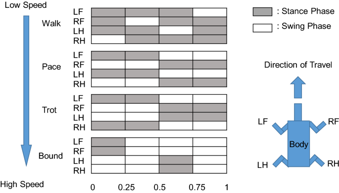

## Plan for today

## What is a "Gait"

# Gaits 

## Gaits

<iframe width="560" height="315" src="https://www.youtube.com/embed/IxxamiRscyY" title="YouTube video player" frameborder="0" allow="accelerometer; autoplay; clipboard-write; encrypted-media; gyroscope; picture-in-picture; web-share" allowfullscreen></iframe>

##


<iframe width="560" height="315" src="https://www.youtube.com/embed/jMIiB9DnRXg" title="YouTube video player" frameborder="0" allow="accelerometer; autoplay; clipboard-write; encrypted-media; gyroscope; picture-in-picture; web-share" allowfullscreen></iframe>




## 

[file](file:///home/danaukes/websites/foldable-camp/docs/modules/05-gaits-and-functions/File Alternating_Tripod_Gait.webm)

## 

[file](file:///home/danaukes/websites/foldable-camp/docs/modules/05-gaits-and-functions/File Gait-of-healthy-Hamster.ogv)

## 

{height="5in"}


# Graphs

## 

{height="5in"}

{height="5in"}

## 

{height="5in"}

## 
{height="5in"}

## 

{height="5in"}

## 

{height="5in"}

## Muscles

{height="5in"}

## 

{height="5in"}


## Sinusoids

<iframe width="560" height="315" src="https://www.youtube.com/embed/YhpOZcjrvQM" title="YouTube video player" frameborder="0" allow="accelerometer; autoplay; clipboard-write; encrypted-media; gyroscope; picture-in-picture; web-share" allowfullscreen></iframe>

## Wavelength, Frequency

<iframe width="560" height="315" src="https://www.youtube.com/embed/9VSHa1mKcTw" title="YouTube video player" frameborder="0" allow="accelerometer; autoplay; clipboard-write; encrypted-media; gyroscope; picture-in-picture; web-share" allowfullscreen></iframe>

## Functions

```python

def myfunction(variable1,variable2):
    internal_variable = variable1+variable2
    return internal_variable

```

## Math

```python
import math

a = math.sin()
```

## Code

```python
#import all the libraries
# from machine import Pin
# from machine import PWM
import math
import time
from machine import Pin
from machine import PWM

# define constants
# This is the servo's driving frequency, which equals 20ms (1/f=t).
servo_frequency = 50
# This PWM value corresponds to the servo's smallest angle (0)
range_low = 28
# This PWM value corresponds to the servo's largest angle (180)
range_high = 122

# save the initial time in nanoseconds as t0
t0 = time.time_ns()

def angle_to_pwm(degrees):
    '''
    this function converts a desired angle to
    its corresponding PWM value, using the range_low 
    and range_high constants defined inline
    '''
    # compute output scaling
    output_range = range_high-range_low
    # compute input scaling
    input_range = 180-0
    # divide the desired angle by the input scaling, multiply
    #by the output scaling, and add the range_low value as an offset.
    output_pwm = ((degrees/input_range)*output_range)+range_low

    if output_pwm < range_low:
        output_pwm = range_low

    if output_pwm > range_high:
        output_pwm = range_high
        
    # return the computed value as an integer
    return int(output_pwm)

def get_seconds_float():
    '''
    This function accesses the internal time_ns() function and
    converts it to a floating point value in seconds
    '''
    # get current time, t in nanoseconds
    t = time.time_ns()
    # subtract from t0 to obtain the time since the program began
    dt = t-t0
    # convert to a float firsty, and then convert from nanoseconds
    # to seconds by multiplying by 10^9
    dt = float(dt)/1e9
    # return the change in time.
    return dt

f = .5
A = 90
b = 90

l1 = 0
l2 = .25
l3 = .5
l4 = .75

# create a new PWM instance and call it servo1
servo1 = PWM(Pin(13), servo_frequency)
servo2 = PWM(Pin(12), servo_frequency)
servo3 = PWM(Pin(14), servo_frequency)
servo4 = PWM(Pin(27), servo_frequency)

# here is our main loop
while True:
    # time.sleep is not as necessary...can be commented
    # out except if you want to print values out.
    #time.sleep(.01)
    
    # get the current time in (floating-point) seconds
    t = get_seconds_float()

    # compute the desired angle for servo 1
    y1 = A*(math.sin((2*(f*t-l1))*math.pi)) + b
    y2 = A*(math.sin((2*(f*t-l2))*math.pi)) + b
    y3 = A*(math.sin((2*(f*t-l3))*math.pi)) + b
    y4 = A*(math.sin((2*(f*t-l4))*math.pi)) + b

    # print out the desired angle.  Not essential, can be commented out
    print(y1)

    # set servo 1 pwm value according to the desired angle
    servo1.duty(angle_to_pwm(y1))
    servo2.duty(angle_to_pwm(y2))
    servo3.duty(angle_to_pwm(y3))
    servo4.duty(angle_to_pwm(y4))
    ```
