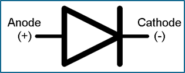

## PART TYPES

* Parts usually come in a couple of main package types. The most common are through-hole and surface mount
      * Of course, there are many more classifications for different sizes, shapes, etc.
* Through-hole parts are used mainly for prototyping on breadboards
* Surface-mount parts are usually for ‘final products’

* Through-Hole

* Surface Mount

* Flat

## SCHEMATICS

* How engineers explain electrical designs quickly
      * Architect : blueprint as engineer : schematic
* Each symbol represents a part!

## CONCEPTS

* Direct current (DC)- electricity flows one-way and at one level
* Alternating current (AC)- electrical current that changes magnitude and flows back and forth (very quickly)
* Circuits use/require voltage, current, and resistance
    * Voltage- the push of charged electrons through a circuit
    * Current- the flow of the electrons
    * Resistance- the opposition to the flow of electrons

## CAPACITORS

* Job:
* Stores up electric energy in electric field using two close (but not touching) plates
* Notes:
* There are different types- ceramic, polar, surface mount
* Used In:
* Wall / laptop chargers
* Symbol:

## DIODES

* Job:
* Makes current flow in one direction.
* Notes:
* Like a one-way switch
* Used In:
* Switches, oscillators, etc.
* Symbol:

## INDUCTORS

* Job:
* Stores energy in magnetic field by running a current through a looped wire
* Notes:
* The number of loops, how tight the loops are bound, etc. can affect the inductance
* Used In:
* Filtering signals, energy storage
* Symbol:

## LEDs

* Job:
* Emits light we can see when current passes through
* Notes:
* They are pretty :)
* Used In:
* Pretty much anything that lights up
* Symbol:

## MICROCONTROLLERS

* Job:
* Control the functions of a system
* Notes:
* Basically a small computer
* Used In:
* Anything that requires higher function
* Symbol:

## OLEDs, LCD

* Job:
* Uses either current or backlight /reflector to light up certain parts and display characters
* Notes:
* Organic Light Emitting Diode; Liquid Crystal Display
* Used In:
* TV screens, video game screens, etc.
* Symbol:

## RESISTORS

* Job:
* Electrically resists the current in a circuit.
* Notes:
* Keeps circuits from overloading
* Used In:
* EVERYTHING
* Symbol:

## SEMICONDUCTORS

* Material type that is in between a conductor (like copper) and an insulator (like glass)
* Conducts electricity better with certain conditions, like temperature
      * Temperature increases > resistivity decreases
* Usually made of elements like Si (silicon) or Ge (germanium)

## TRANSFORMERS

* Job:
* Transfers electrical energy from one circuit to
* another
* Notes:
* Can change the voltages of AC, doesn’t work on DC
* Used In:
* Power grid- how you get power to your house!
* Symbol:

## TRANSISTORS

* Job:
* Switches or amplifies electrical signals/power.
* Notes:
* Semiconductor device! Many different types.
* Used In:
* Computer memory, smartphones
* Symbol:

## VOLTAGE REGULATORS

* Job:
* Make stable voltages; step up/down voltages
* Notes:
* Two main types- linear and switching
* Used In:
* AC/DC, DC/DC, AC/AC power conversion
* Symbol:

## HELPFUL SITES & RESOURCES

* Multisim: Online Circuit Simulator (schematic-heavy)
*  <https://www.multisim.com/>
* TinkerCAD: Model a circuit (part-heavy)
*  <https://www.tinkercad.com/circuits>
* DigiKey: Resistor color code calculator
* <https://www.digikey.com/en/resources/conversion-calculators/conversion-calculator-resistor-color-code>
