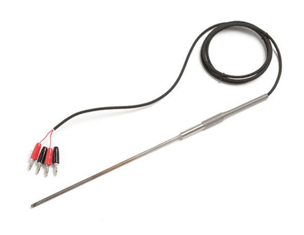

## What are sensors?

* A sensor is a device used to measure physical properties of an object or system.
* Common physical properties:
* Light
* Pressure/Force
* Motion
* Heat
* Humidity/Moisture
* Color
* Position/Velocity
* Acceleration
* Strain

## What is the purpose of using sensors?

* Industrial use
    * Monitor systems
    * Control processes
    * Safety measures
*
*
* Medical use
    * Diagnose patients
    * Monitor vitals
*
*

## How do sensors work? Let’s start by understanding a circuit

* Example of a circuit:

## How do sensors work continued…

* Example of a pressure sensor:

* The pressure is converted into a standard electrical signal by the sensor.

## Light

* Lots of different mechanisms for light
* Photoresistor
* Photodiode
    * Photovoltaic
        * +light –> +V
    * Photoconductor
        * +light –> -R
* Phototransistor
    * +light

## Magnetic Field

##

##

*
    * Types
        * Reed Switch
        * Inductive - Galvonometer
        * Hall Effect Sensor – go linear.
* <http://howtomechatronics.com/how-it-works/electrical-engineering/hall-effect-hall-effect-sensors-work/> <http://www.brown.edu/Departments/Engineering/Courses/En123/CirRevFiles/Inductance2.htm>

## Motion

* Accelerometer
    * accelerations
* Gyro
    * Angular accelerations
* IMU
    * Everything
        * Smoothing
        * Integration
        * Position, Velocity, Acceleration
        * Rotation, rotational velocity, angular acceleration

## Position - Resistive

##

*
    * Temperature-dependence
    * Hysterisis
    * Types
        * Linear Potentiometer
        * Rotary Potentiometer
        * Flex Sensor
        * etc

## Position - Capacitive

##

## Position - Other

* Theory

##

* Emitter/Detector Pair
    * Proximity
    * Based on reflectance
* Ultrasonic
    * High Noise
    * Longer distances

##

* <http://maxembedded.com/2013/08/how-to-build-an-ir-sensor/>

## Pressure / Force

##

*
    * Strain Gauge
        * Temperature-sensitive
        * Wheatstone Bridge
        * Load Cell
    * Other Position Sensors

## Dynamic Tactile Sensing

##

* Piezoelectric Sensor

## Position - Induction

##

*
    * Non-contacting
    * Requires AC
    * Senses Metals, esp Ferrous Metals
    * Types:
        * Inductive Proximity Switch, Position Sensors
        * LVDT
        * Inductive Encoders
* <https://sensortech.wordpress.com/2014/03/05/basic-operating-principle-of-an-inductive-proximity-sensor/>
* <http://sensorwiki.org/doku.php/sensors/linear_variable_differential_transformer>

## Temperature

##

*
    * RTD: Resistance temperature detector
    * Thermistor
    * Thermocouple

## Encoders

* Types
    * Optical
        * Absolute
        * Relative
    * Magnetic
    * Capacitive
    * Inductive

## Embedding Sensors

##

##

##

##

##

## Common Circuits

##

* <http://hades.mech.northwestern.edu/index.php/Photodiodes_and_Phototransistors>

##

##

##

## Circuit Conditioning

* Self-contained packages
* Op Amps
* Transistor-based amplification
