<!--
## After Lunch Plan

* Origami Wrapup - More Mechanisms
* Biomechanics & Bioinspiration
* continue identifying important keywords and putting them in padlet
* Look up an animal
* look up keywords in google scholar
* Make a 1-slide presentation / proposal
  * what motion do you want to
  * find a video of it moving
  * what information did you find on it?
  * What’s your idea for how to make it “foldable”?
* Form Teams
* Make a body module.

-->

## Bio-Inspiration

  * Robotic Systems help us understand the biological world
  * Can mimic biological structures
  * Experiments can be designed and repeated vs. observed.
  * Variation in form and function can be introduced

## The Human Skeleton - A (Branching) Serial Mechanism

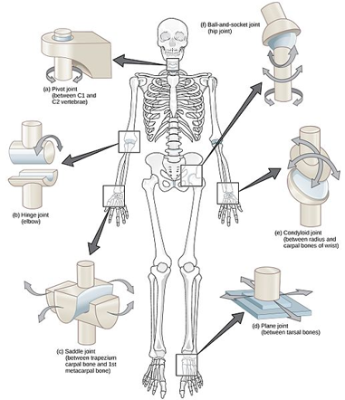

* CNX OpenStax, CC BY 4.0, via Wikimedia Commons

* Many human joints can be approximated by “basic” joint types

## Skeletons Can be Parallel Mechanisms

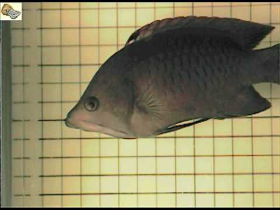
[Video](https://www.youtube.com/watch?v=pDU4CQWXaNY)

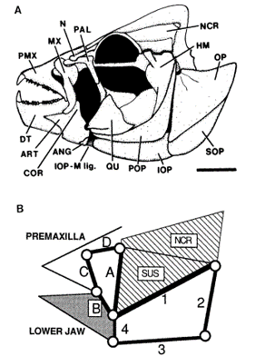

* https://www.youtube.com/watch?v=pDU4CQWXaNY

* Westneat, M.W. (1990), Feeding mechanics of teleost fishes (Labridae; Perciformes): A test of four-bar linkage models. J. Morphol., 205: 269-295. https://doi.org/10.1002/jmor.1052050304

## Arthropod Joints

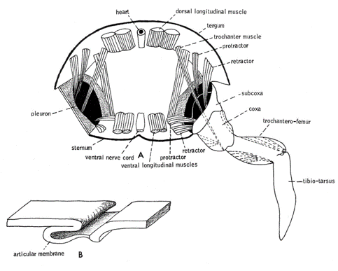

* From Barnes, R. D. 1964. Invertebrate Zoology. W. B. Saunders. Philadelphia.  Found here

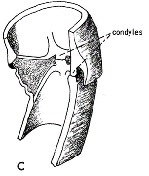

## Arthropod Joints

* Different Joint types, different degrees of freedom

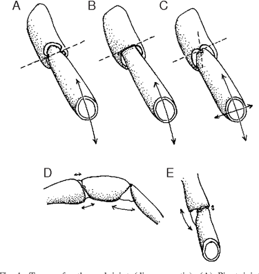

* Wootton, Robert J.. “Invertebrate paraxial locomotory appendages: design, deformation and control.” The Journal of experimental biology 202 Pt 23 (1999): 3333-45 .

## Skeletal Muscle Tissue

* https://open.oregonstate.education/aandp/chapter/10-2-skeletal-muscle/
* Anatomy & Physiology by Lindsay M. Biga, Sierra Dawson, Amy Harwell, Robin Hopkins, Joel Kaufmann, Mike LeMaster, Philip Matern, Katie Morrison-Graham, Devon Quick & Jon Runyeon is licensed under a Creative Commons Attribution-ShareAlike 4.0 International License, except where otherwise noted.

## Skeletal Muscle

* Biewener, Andrew & Gillis, Gary. (2000). Dynamics of muscle function during locomotion: Accommodating variable conditions. The Journal of experimental biology. 202. 3387-96. 10.1242/jeb.202.23.3387.

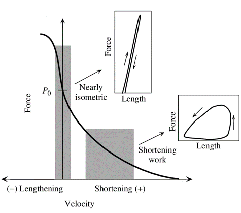

## Work Loop

* 
* https://en.wikipedia.org/wiki/Work_loop

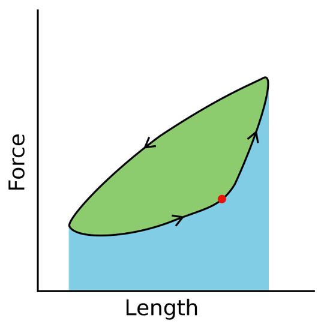

## Muscles can do Different things

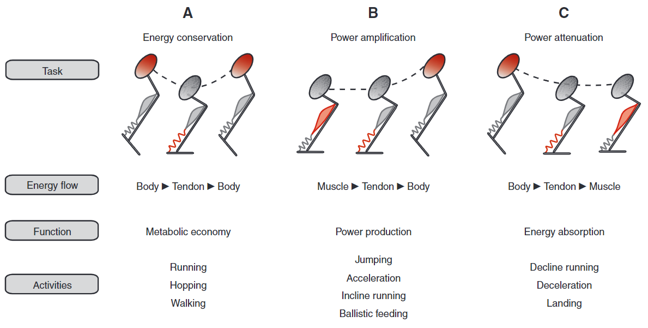

* Roberts, T. J., & Azizi, E. (2011). Flexible mechanisms: the diverse roles of biological springs in vertebrate movement. Journal of Experimental Biology, 214(3), 353–361. https://doi.org/10.1242/jeb.038588

## Inverted Pendulum vs Spring-Loaded Inverted Pendulum

## Passive Dynamic Walker

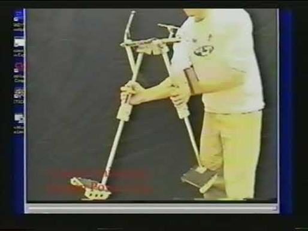
[Video](https://www.youtube.com/watch?v=FfKQSUhYjlY)

## SLIP Legs

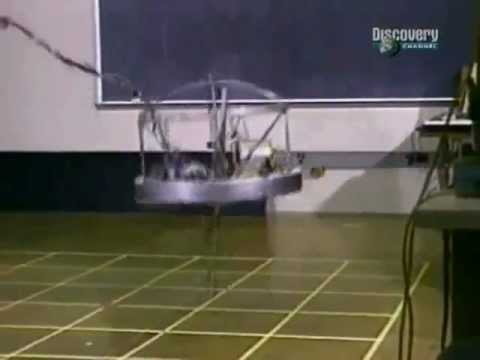
[Video](https://www.youtube.com/watch?v=XFXj81mvInc&feature=emb_logo)

## Implementations of SLIP

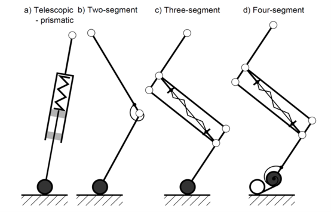

* A. Sprowitz, A. Tuleu, M. Vespignani, M. Ajallooeian, E. Badri, and A. J. Ijspeert, “Towards dynamic trot gait locomotion: Design, control, and experiments with Cheetah-cub, a compliant quadruped robot,” Int. J. Rob. Res., vol. 32, no. 8, pp. 932–950, Jul. 2013.

## 

[Video](https://www.youtube.com/watch?time_continue=224&v=BUmOKfllAEo&feature=emb_logo)

## 

[Video](https://www.youtube.com/watch?time_continue=485&v=BUmOKfllAEo&feature=emb_logo)

## Cheetah Cub

[Video](https://www.youtube.com/watch?time_continue=554&v=K926HAKRFvw&feature=emb_logo)

## MIT Cheetah

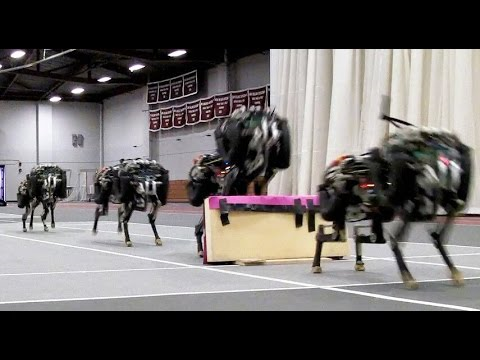
[Video](https://www.youtube.com/watch?time_continue=73&v=_luhn7TLfWU&feature=emb_logo)

## Different Animals

* M. H. Dickinson, “How Animals Move: An Integrative View,” Science (80-. )., vol. 288, no. 5463, pp. 100–106, Apr. 2000.

## Peristaltic Locomotion

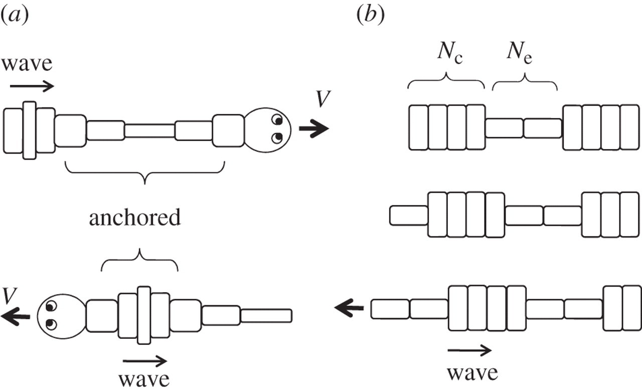

* Mechanics of peristaltic locomotion and role of anchoringJ. R. Soc. Interface.9222–233http://doi.org/10.1098/rsif.2011.0339

## Peristaltic

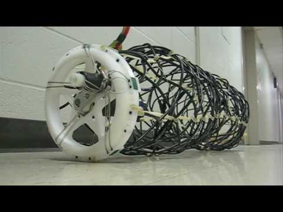
[Video](https://www.youtube.com/watch?time_continue=16&v=f6mA8walaSk&feature=emb_logo)

## Undulatory

[Video](https://www.youtube.com/watch?v=CkZszsl2aIU&feature=emb_logo)

## Swimming In Sand

[Video](https://www.youtube.com/watch?time_continue=2&v=9mwJsGbTkOk&feature=emb_logo)

## Climbing with Stickybot

[Video](https://www.youtube.com/watch?v=e4ntbQ6isIk&feature=emb_logo)

## Foldable-Compatible Legged

* Already Foldable
* Dash
* HAMR
* DynaROACH
* Non-Foldable
* ATRIAS/Cassie
* Penn Jerboa
* Stanford Doggo

## HAMR

[Video]()

## DASH

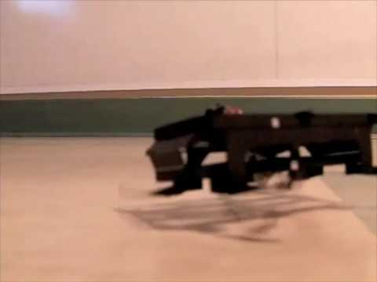
[Video](https://www.youtube.com/watch?time_continue=1&v=UjGIJR5Mxjo&feature=emb_logo)

## ATRIAS Family

## ATRIAS / CASSIE

[Video](https://www.youtube.com/watch?time_continue=43&v=Is4JZqhAy-M&feature=emb_logo)

