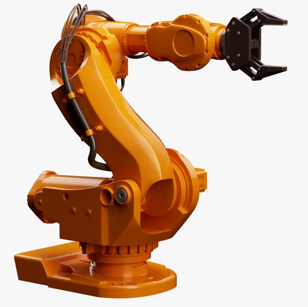
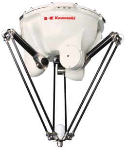
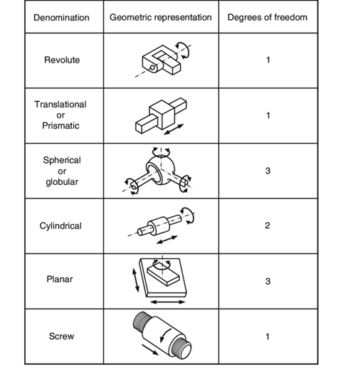
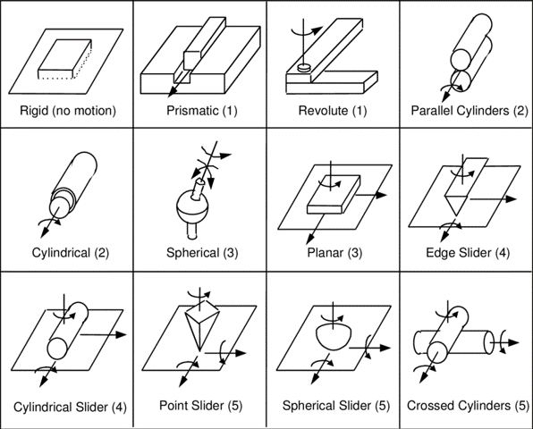
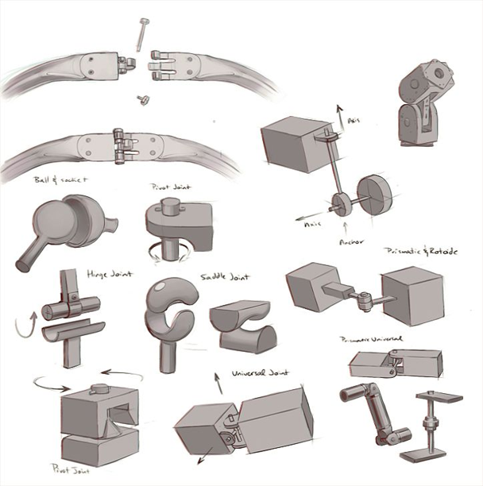
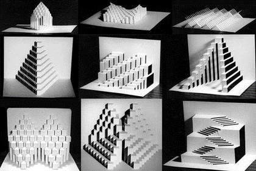
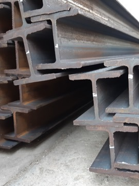

---
title: Foldable Mechanisms
---

## Keywords

* Mechanism
* Linkage
* Link
* Joint
* Degrees of Freedom

## Why are we talking about foldable mechanisms?

* Robots are mechanisms, or machines.
* Serial vs. Parallel
* Composed of links and joints

## Mechanisms

* A system of parts working together in a machine; a piece of machinery.

* https://en.wikipedia.org/wiki/Mechanism_(engineering)

* https://languages.oup.com/google-dictionary-en/

## Structures?

* What is a structure?

## Linkage

* A system of links; especially a system of links or bars which are jointed together and more or less constrained by having a link or links fixed and by means of which straight or nearly straight lines or other point paths may be traced

* https://www.merriam-webster.com/dictionary/linkage

* https://en.wikipedia.org/wiki/Linkage_(mechanical)\

## Link

* An intermediate rod or piece for transmitting force or motion; especially, a short connecting rod with a hole or pin at each end.

## Joints

* In robotics, joints are the (moving) connections between rigid bodies
* Many different kinds of joints
* Folded devices use

* Flores, Paulo & Lankarani, Hamid. (2016). Contact Force Models for Multibody Dynamics.

## Degrees of Freedom

* “The number of independent parameters that define its configuration or state”
* The position of a single railcar (engine) moving along a track has one degree of freedom
* Position and orientation of a rigid body in space is defined by three components of translation and three components of rotation, which means that it has six degrees of freedom.

* https://en.wikipedia.org/wiki/Degrees_of_freedom_(mechanics)

## More Complex Joints

* Chase, Kenneth & Magleby, Spencer & Glancy, Charles. (2000). A Comprehensive System for Computer-Aided Tolerance Analysis of 2-D and 3-D Mechanical Assemblies. 10.1007/978-1-4615-5797-5_23.

## Joints

* https://24.media.tumblr.com/tumblr_mck6ejg15N1r0v3zro3_1280.jpg

## Types of Linkages

* Planar
* four-bar
* five-bar
* six-bar
* …
* Spherical
* four-bar
* five-bar
* six-bar
* …

* Other:
* Sarrus
* Straight-line
* Slider-Crank
* More Info
* https://en.wikipedia.org/wiki/Linkage_(mechanical)#Image_gallery
* https://engineering.library.cornell.edu/kmoddl/

## Activity

* Get out construction paper, scissors, staplers, etc

## Origami vs. Kirigami

* https://www.youtube.com/watch?v=kUsxMXwCW8A

* Origami: Less about mechanisms than “structures” or “form”

## Origami is not about creating mechanisms

## “Foldable” Links

* How can you stiffen material to create a better link?
  * …
  * …
  * …
* Engineering Context: I-beams

## “Foldable” Joints

* What joints can you make with origami/kirigami techniques?
* How can you weaken material to create a better joint?
  * …
  * …
  * …

## Identical mechanisms, many ways to get there

* Four-Bar Linkage Example
* Sarrus Example

